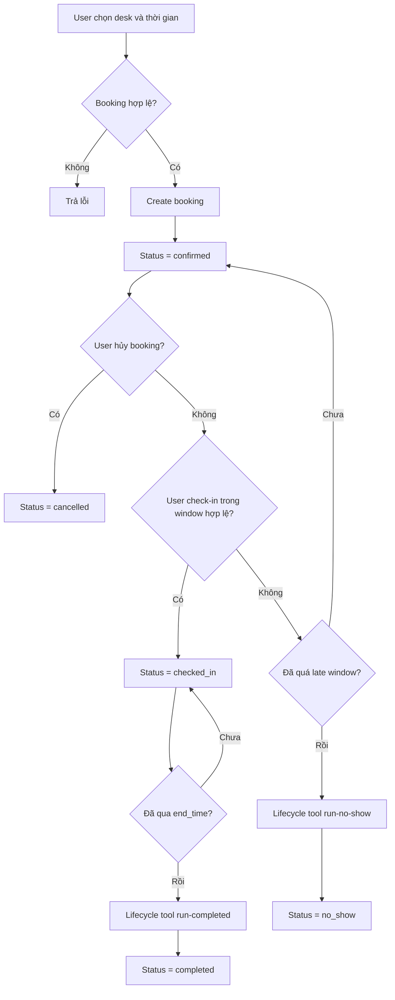

# Activity Diagram - Booking Lifecycle MVP / As-is

## Phân loại sơ đồ

Sơ đồ này thuộc nhóm:

- `As-is`
- `MVP implemented`
- `phản ánh đúng rule trạng thái booking đang có trong code`

## Nguồn dựng sơ đồ

- `src code/apps/api/src/bookings/bookings.service.ts`
- `src code/apps/api/src/check-in/check-in.service.ts`
- `src code/apps/api/src/bookings/bookings.service.spec.ts`
- `plan/WORK_CHECKLIST.md`

## Ghi chú nghiệp vụ

1. Booking mới được tạo với trạng thái `confirmed`.
2. Chỉ booking `confirmed` hoặc `checked_in` mới chiếm chỗ trong logic overlap.
3. Booking `confirmed` có thể chuyển sang:
   - `cancelled`
   - `checked_in`
   - `no_show`
4. Booking `checked_in` có thể chuyển sang `completed`.
5. `run-no-show` và `run-completed` hiện là lifecycle tools gọi thủ công, chưa phải cron production.

## Vị trí nên chèn vào báo cáo

- Chương 5: chức năng booking core
- Chương 6: đánh giá và mô tả vòng đời booking

