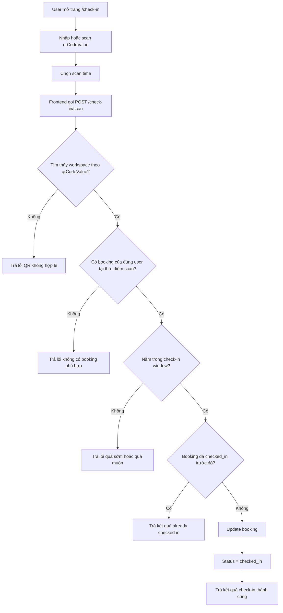

# Activity Diagram - Check-in MVP / As-is

## Phân loại sơ đồ

Sơ đồ này thuộc nhóm:

- `As-is`
- `MVP implemented`
- `phản ánh đúng luồng check-in hiện tại bằng QR tĩnh`

## Nguồn dựng sơ đồ

- `src code/apps/api/src/check-in/check-in.service.ts`
- `src code/apps/api/src/check-in/check-in.service.spec.ts`
- `src code/apps/web/app/check-in/page.tsx`
- `plan/WORK_CHECKLIST.md`

## Rule hiện tại

1. QR hiện tại là QR tĩnh theo workspace.
2. Backend không chỉ kiểm tra QR, mà còn kiểm tra:
   - user hiện tại
   - booking phù hợp theo thời gian
   - cửa sổ check-in hợp lệ
3. Check-in sớm tối đa `10 phút` trước `start_time`.
4. Check-in muộn tối đa `min(30 phút, 1/4 thời lượng booking)`.
5. Nếu booking đã check-in từ trước, hệ thống trả kết quả idempotent thay vì tạo trạng thái mới.

## Vị trí nên chèn vào báo cáo

- Chương 5: QR management và check-in
- Chương 6: đánh giá logic xác nhận nhận chỗ

