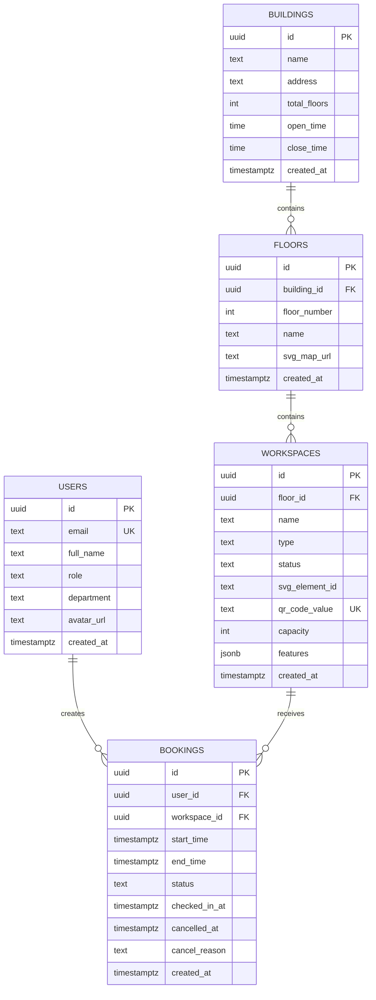

# ERD MVP - Workspace Booking

## Phân loại sơ đồ

Sơ đồ này thuộc nhóm:

- `As-is`
- `MVP implemented`
- `schema đang chạy thực tế`

Không dùng ERD này như ERD full system cuối cùng nếu về sau dự án bổ sung thêm bảng hoặc module mới như:

- dynamic QR theo booking
- notification
- waitlist
- meeting room
- audit log mở rộng
- analytics/reporting

Quy tắc chèn vào báo cáo:

1. Dùng sơ đồ này cho phần mô tả database đã triển khai và đã kiểm chứng.
2. Nếu cần mô tả dữ liệu mục tiêu của toàn hệ thống, phải tạo thêm ERD `To-be` riêng.
3. Không tự thêm entity "dự kiến" vào ERD này nếu chúng chưa tồn tại trong schema thật.

Nguồn dựng sơ đồ:

- `src code/supabase/01_schema.sql`
- `src code/supabase/02_auth_and_policies.sql`
- `src code/supabase/03_seed.sql`

Mục đích:

- chốt mô hình dữ liệu đang chạy thực tế của MVP
- dùng làm nguồn để xuất hình ERD đưa vào báo cáo
- tránh vẽ sai so với schema đã triển khai trên Supabase

## Ghi chú quan trọng cần nêu trong báo cáo

1. `users.id` map trực tiếp với `auth.users.id` của Supabase Auth.
2. `floors` có unique `(building_id, floor_number)`.
3. `workspaces` có unique `(floor_id, svg_element_id)` để tránh trùng mapping trong cùng một tầng.
4. `workspaces.qr_code_value` là unique toàn hệ thống trong bản MVP hiện tại.
5. `bookings` có exclusion constraint chống overlap cho cùng `workspace_id` khi status thuộc:
   - `confirmed`
   - `checked_in`
6. QR hiện tại là QR tĩnh theo workspace, chưa phải QR động theo từng booking.

## Vị trí nên chèn vào báo cáo

- Chương 3: Thiết kế hệ thống
- Mục 3.4: Thiết kế cơ sở dữ liệu
