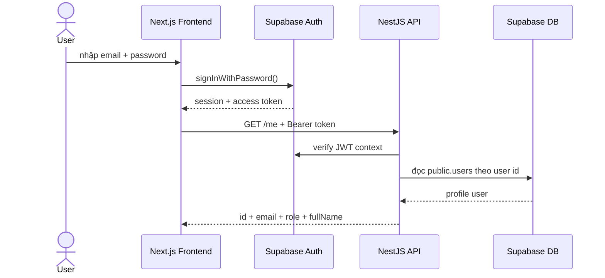
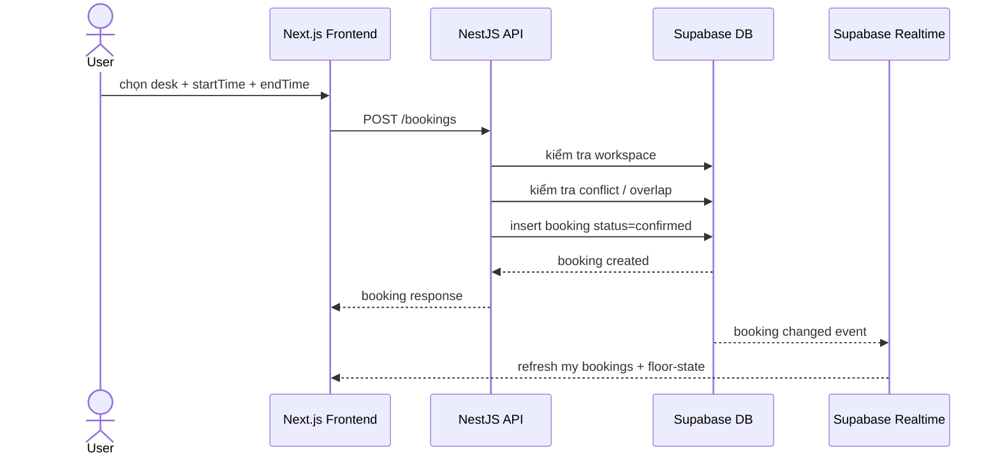
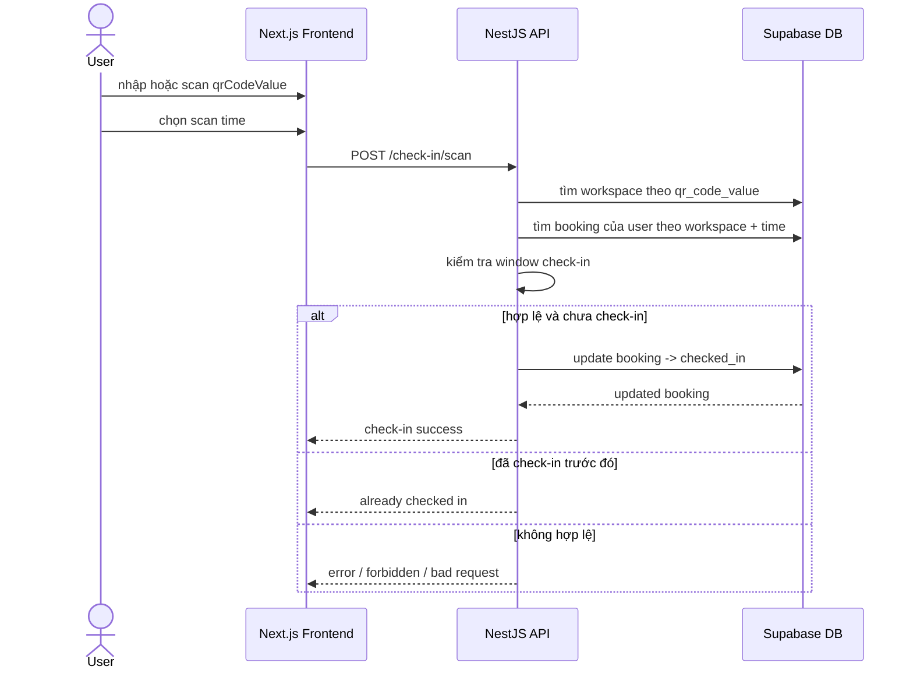
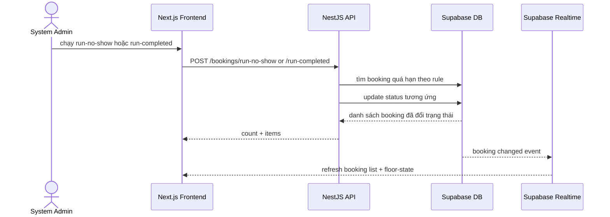

# Sequence Flows - MVP

## Phân loại sơ đồ

Các sequence trong file này thuộc nhóm:

- `As-is`
- `MVP implemented`
- `luồng đã có thật trong code`

Điều này có nghĩa:

1. Chỉ mô tả các route, module và hành vi đang tồn tại ở thời điểm hiện tại.
2. Không dùng file này để đại diện cho full workflow tương lai nếu sau này thay đổi nghiệp vụ.
3. Khi bổ sung flow mới như QR động, notification, scheduler tự động, phải tạo thêm sequence mới hoặc tách file `Target flows`.

Quy tắc chèn vào báo cáo:

- dùng cho phần mô tả cài đặt và kiểm chứng hệ thống hiện tại
- không dùng thay cho luồng mục tiêu cuối cùng nếu proposal có scope rộng hơn

Nguồn dựng sơ đồ:

- `src code/apps/api/src/auth/...`
- `src code/apps/api/src/bookings/...`
- `src code/apps/api/src/check-in/...`
- `src code/apps/web/app/login/page.tsx`
- `src code/apps/web/app/floor-map/page.tsx`
- `src code/apps/web/app/check-in/page.tsx`
- `src code/apps/web/app/bookings/page.tsx`

## 1. Auth flow

## 2. Booking flow

## 3. Check-in flow

## 4. Lifecycle tools flow

## Gợi ý chèn vào báo cáo

- Auth flow:
  - Chương 5, mục xác thực và phân quyền
- Booking flow:
  - Chương 5, mục booking core
- Check-in flow:
  - Chương 5, mục QR management và check-in
- Lifecycle tools flow:
  - Chương 5 hoặc Chương 6, mục vòng đời booking
