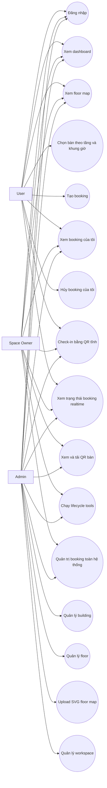

# Use Case - MVP / As-is

## Phân loại sơ đồ

Sơ đồ này thuộc nhóm:

- `As-is`
- `MVP implemented`
- `phản ánh chức năng hiện đang có thật trong hệ thống`

Không dùng sơ đồ này để mô tả full system trong tương lai nếu sau này bổ sung:

- QR động theo booking
- notification
- dashboard analytics
- meeting room booking
- waitlist

## Nguồn dựng sơ đồ

- `plan/WORK_CHECKLIST.md`
- `Report/REPORT_DRAFT.md`
- `src code/apps/web/app/...`
- `src code/apps/api/src/...`

## Ghi chú dùng trong báo cáo

1. Đây là use case của bản MVP đang chạy, không phải full target system.
2. Một số nghiệp vụ đang ở mức prototype kỹ thuật, đặc biệt là camera scan trên mobile.
3. Use case này nên đặt ở phần:
   - phân tích yêu cầu chức năng đã triển khai
   - hoặc phần actor và chức năng trong báo cáo chính

